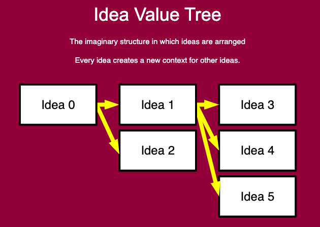

# Stage 1: Project Discovery

  

> Previous: [Stage 0: Getting Started](./stage-0-getting-started.md) | Next: [Stage 2: Project Exploration](./stage-2-project-exploration.md)

  
## Identifying Potential Projects

 - Official Go implementation of the Ethereum protocol https://github.com/ethereum/go-ethereum
    - Enhance documentation https://github.com/ethereum/go-ethereum/pull/23813
    -  Add informational metrics to prometheus endpoint https://github.com/ethereum/go-ethereum/issues/21783

- Go implementation of Verkle trees by [Guillaume Ballet](https://github.com/gballet)
    -  [#64: use a pool for polynomial allocations](https://github.com/gballet/go-verkle/issues/64) : Performance optimization for Leaf Nodes
    -   **Goal**: Analyse pool of nodes for polynomial allocations and explore verkle trees in depth and fix this issue.
    -  Fix/Implement the issues/features listed at Github

- Rust implementation of Verkle trees by [Kevaundray_ Wedderburn](https://github.com/kevaundray) 
    -    Fix/Implement the issues/features listed at Github

-  Nanoeth : implementation of Ethereum's execution layer by [Nicolas Laurent](https://github.com/norswap/)
   - Fix/Implement the issues/features listed at Github

## Finalizing Potential Projects

On one fortunate day I stumbled upon a talk by [Piper Merriam, Angela Lu : Stateless Ethereum and The Portal Network](https://www.youtube.com/watch?v=jAX_bgcESoc) 

[Exploring Portal Network ](./sources/ethereum-portal-network.md)
[Exploring Public Goods Funding](./sources/public-goods-funding.md)

### 1. Project Proposal

####  Make Documentation Great Again ( MDGA )

 
- Write documentation/tutorials for Portal Network. 
  
 Comprehension (insight) is best learned from who first achieved said understanding — an "[original communication](https://en.wikipedia.org/wiki/How_to_Read_a_Book)".

The idea that communication directly from those who first discovered an idea is the best way of gaining understanding.

-    [Mind Map](https://www.wikiwand.com/en/Mind_map) to visually organize information and provide better context from the early ethereum journey to Portal Network. 

      -    Sample Mind Map Work In Progress: https://miro.com/app/board/o9J_lkXlE3s=/?invite_link_id=696443224967

 - Sample Write Up by Leo Zhang : https://medium.com/@chiqing/merkle-patricia-trie-explained-ae3ac6a7e123

I was trying to wrap my head around the Ethereum block architecture. Had difficult times connecting the dots and here is the best visual diagram I found. https://ethereum.stackexchange.com/a/6413 Still believe we can do better with more useful block diagrams and mind maps to help [connect the dots](https://news.stanford.edu/2005/06/14/jobs-061505/) better.

With tools like mind maps/good documentation/tutorial, we will be able to bridge the gap of better context to pave way for meaningful contributions to Portal Network or any other project in the Ethereum ecosystem.

 
####  Author an EIP and corresponding POC implementation for creating a transparent system to contextualise and rank ideas.

Create a ranking mechanism to value ideas and contexts a share of any profits that arise from them.

The main objective is to accelerate the revelation and realisation of valuable ideas and create a idea-value tree

Potential features:
-  That every new idea creates a potential context in which to rank other ideas. A tree-like structure of linked contexts is formed and used to visualise ideas in a sequence of ranked lists. This is called the idea-value tree.

    - Example. Ethereum --> Distributed Ledger --> Blockchain --> CryptoGraphy -->  Computer science --> Maths. You can go all the way to the end to find its root. And that's the root of Idea Value Tree( check the image above). 

-  The ability to claim ownership of a new idea or context, and to transfer those claims to others. This offers the potential for a market for ideas and contexts using the trade of verifiable idea ownership claims.

Potential Use Case:
- Incentivize the EIP authoring process
- Ideas and Patents
- Ideas and Copyrights

### 2. Explore New Territory

  
#### Deep dive into Portal Network
    
- Use Rust-Lang docs for documentation of Portal Network 
    -    Cargo documentation: https://github.com/rust-lang/cargo/tree/master/src/doc
    - Target Group
        - New Contributors
        - People interested in building their own portal clients
        - People who want to contribute to the testnet by running trin

- Deep dive into Transaction Architecture   of Portal Network    
    - State
    - Gossip
    - History
    - more??
    
-  Learn Rust 
    -  Small exercises to get you used to reading and writing Rust code: https://github.com/rust-lang/rustlings
    -  Writing an OS in Rust: https://os.phil-opp.com/ 

-  Meaningful contributions to Trin project, once the fundamentals are good enough.
 

#### Gather context for my POC on creating a transparent system to contextualise and rank ideas.
 - Understand the EIP authoring process in-depth and explore a few ERCs/EIPs
     -   ERC-721 Non-Fungible Token Standard:  https://ethereum.org/en/developers/docs/standards/tokens/erc-721/
     -   ERC-1155 The Crypto Item Standard:  https://blog.enjincoin.io/erc-1155-the-crypto-item-standard-ac9cf1c5a226
     -   Contribute to https://www.nftstandards.wtf/ by Anett Rolikova (founder of Ethereum Magicians) to gain in-depth understanding on NFTs

 - Understand the relationship between ideas and patents  
     - [Wikipedia Link](https://www.wikiwand.com/en/Idea#/Relationship_of_ideas_to_modern_legal_time-_and_scope-limited_monopolies)  

 

### 3. Expand Your Knowledge

- Deep dive into existing Ethereum client protocols and how Portal Network is doing it better?
- Study the existing authoring EIP process and implementation at the client side.
  

### 4. Externally Beneficial

-  A well organized technical write-up of Portal Network
   - Documentation/Tutorials for better understanding of the former and existing protocols

   which should be beneficial to the overall Ethereum ecosystem and to the target group below. 

   - Target Group
        - New Contributors
        - People interested in building their own portal clients
        - People who want to contribute to the testnet by running trin

- Creating a transparent system to contextualise and rank ideas. Who benefits?
    - EIP Authors
